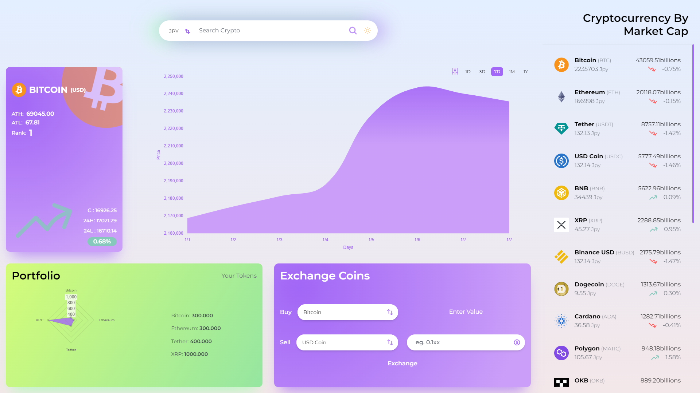

# Crypto Dashboard
## Welcome! 👋

Thanks for checking out this Repo

## Crypto Dashboard Web Application

## Links

- Solution URL: [Github](https://github.com/realgautamjakhar/cryptoDashboard)
- Live Site URL: [Live](https://thunderous-pavlova-2f6bd1.netlify.app/)

## Overview

### The Project

A Crypto Dashboard app built with react js and tailwind css where a user can

- Monitor Crypto Currencies
- Select a coin and see chart for the same with some additional information like current price, high, low and ranking of the coin in crypto market depending on the marketcap
- Portfolio section where user can see how much fund avaiable in his/her wallet
- Exchange coin between different cryptocurrencies
- Different chart user can select based on preference (Line and bar chart)
- Dark mode

## My process

### Built with

- [React](https://reactjs.org/) - JS library
- [Tailwind Css](https://tailwindcss.com/) - For Css
- [Framer motion](https://www.framer.com/motion/) - For Animation
- [Redux Toolkit](https://redux-toolkit.js.org/) - For State Management
- [Chartjs](https://www.chartjs.org/) - For Chart Componenets in App
- [Headless ui](https://headlessui.com/) - For modals and dropDown menu components
- [CoinGecko API](https://www.coingecko.com/en/api/documentation) - For Api data

### Continued development

Adding more feature like comparing different coin

## Author

- Website - [Gautam](https://gautamfolionew.netlify.app/)
- LinkedIn - [@realgautamjakhar](https://www.linkedin.com/in/gautam-jakhar/)
